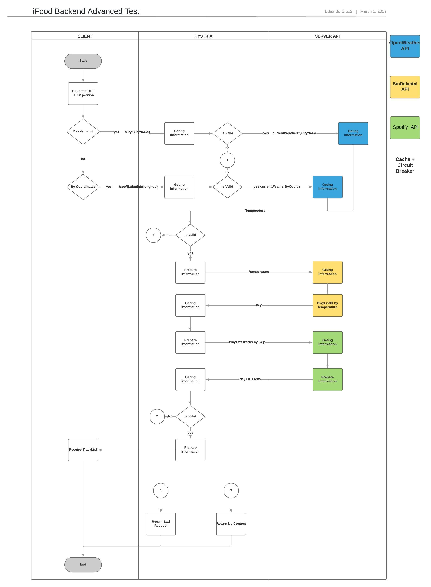
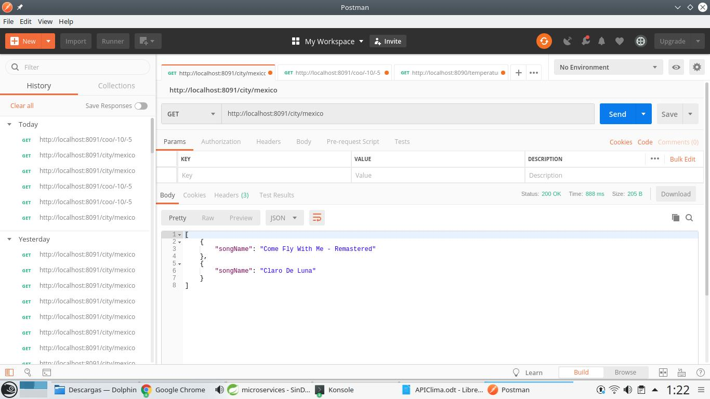
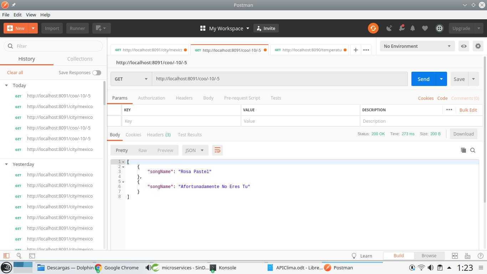
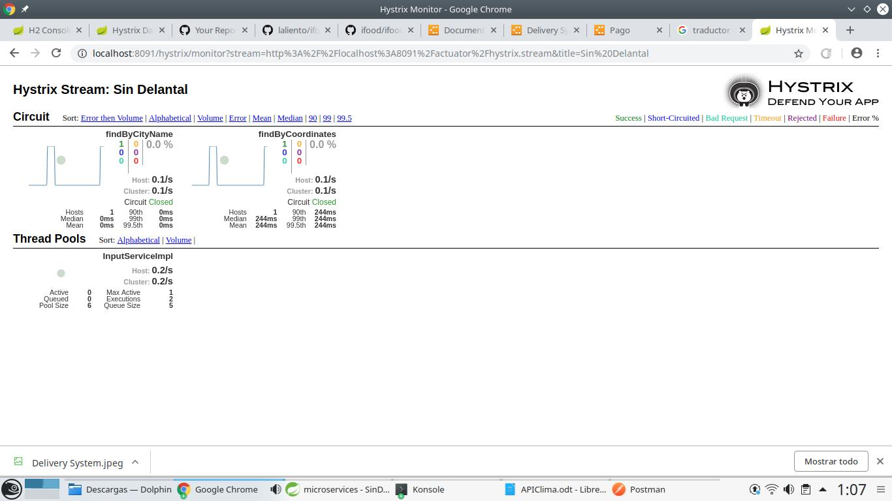

# SinDelantal-Hystrix
SinDelantal API Upgrade

## Prerequisites

### Install lombok plug-in into your IDE.

Once you build the project navigate to lombok jar location and execute the following command where you can select your favorite IDE to install the plug-in.

> java -jar lombok-1.18.2.jar

## Functional diagram

## Bring up the Application

Bring up the application by running following maven command from the project folder.

> mvn spring-boot:run

Once application has started, open Postman or another tool to send

###Find track list by your city name
http://localhost:8091/city/{cityName}

Example
>http://localhost:8091/city/mexico

### Find track list by coordinates
http://localhost:8091/coo/{latitude}/{longitud}

Example
>http://localhost:8091/coo/-10/-5

## Hystrix DashBoard

Bring up the application you can enter to Hystrix DashBoard

### Hystrix URL

> http://localhost:8091/hystrix

### Hystrix Stream

> http://localhost:8091/actuator/hystrix.stream

## Cache and Circuit Breaker

In order to test the cache memory and I have configured

### Cache with Spring

Is configured to remove cache each 10 seconds (only for QA test)
ehcache.xml
	timeToIdleSeconds="10" 
	timeToLiveSeconds="10"
### Circuit Breaker with Hystrix
Each call method to any API has enable the circuit breaker configuration and that try to use the memory
in cache to obtains the information for default if all cache and circuit bracker are not working, the system
response a default track.

## Docker image

>docker-compose.yml

###Note

The project has two jars the principal "Sindelantal-Hystrix" and "SinDelantal", the second one is in the folder
target/ , in the diagram is the "SinDelantal API" you need to run booth projects to see all the functionality
Any question please let me know.

###Docher hub image
   
Sindelantal-Hystrix
>https://cloud.docker.com/repository/registry-1.docker.io/laliento/sindelantalhystrix

Sindelantal
>https://cloud.docker.com/repository/registry-1.docker.io/laliento/sindelantalserver

##Original branch

Sindelantal-Hystrix
>https://github.com/laliento/SinDelantal-Hystrix/tree/master2

Sindelantal
>https://github.com/laliento/SinDelantal